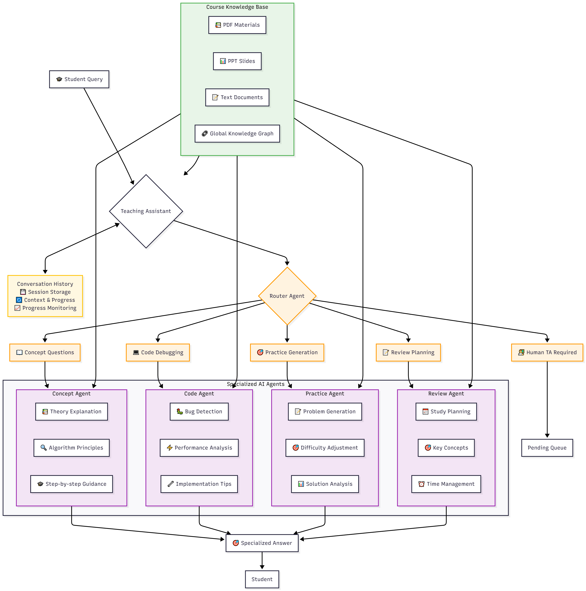
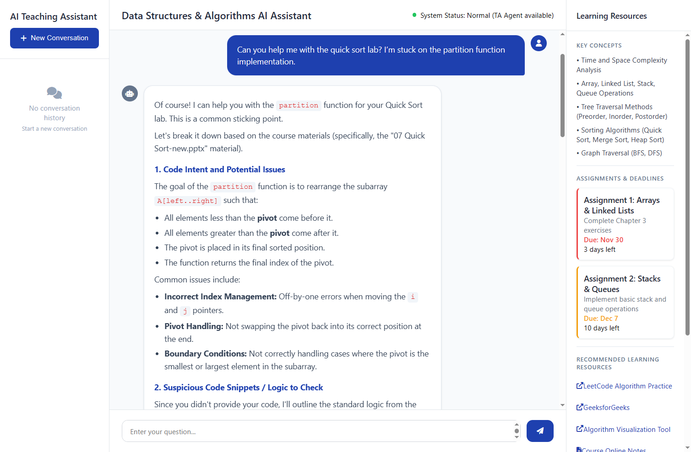

# 多智能体AI助教系统 - 数据结构与算法课程

**🌐 Language:** [English](README.md) | [中文](#)

## 项目概述

📚 数据结构与算法课程多智能体AI助教系统
一个专业化的AI助教系统，模拟专家助教团队，每个智能体专注于课程支持的不同方面。该系统帮助学生进行概念解释、代码调试、练习生成和复习规划，同时保持学术诚信。

## 在线演示
中文演示： http://8.138.234.143:5000/

英文演示： http://8.138.234.143:5001/

## 核心功能
多智能体架构：四个专业智能体在中央路由器协调下协同工作

智能路由：智能分类和路由学生问题

课程上下文感知：基于实际课程材料和术语

24/7支持：在常规助教工作时间外随时可用

双语支持：中文和英文界面

道德护栏：防止学术不端行为，同时提供有帮助的指导

## 系统架构

系统采用多智能体架构，包含以下组件：

路由智能体：中央协调器，分析和分类输入问题

概念智能体：提供理论解释和算法原理

代码智能体：提供调试帮助和代码分析

练习智能体：生成定制化习题和问题

复习智能体：创建学习计划和考试准备材料

## 界面预览

## 专业智能体
### 概念智能体 - 理论解释和算法原理

示例："解释AVL树如何保持平衡"

使用课程材料提供逐步解释

### 代码智能体 - 调试帮助和代码分析

示例："帮我调试二叉搜索树实现"

分析代码中的逻辑错误、边界问题和性能问题

### 练习智能体 - 定制化习题生成

示例："给我5道关于二叉树的中等难度题目"

生成与课程风格和难度匹配的练习题

### 复习智能体 - 学习规划和考试准备

示例："为排序算法章节制定学习计划"

提供结构化复习指南和重点总结

## 快速开始
### 环境要求
Python 3.8+

DeepSeek API密钥

### 安装
克隆仓库：

bash
git clone https://github.com/computersniper/ai-tutor.git
cd multi-agent-ai-tutor
安装依赖：

bash
pip install flask flask-cors python-dotenv PyPDF2 python-pptx openai
设置环境变量：

bash
export DEEPSEEK_API_KEY="您的API密钥"
### 运行系统
命令行界面：

bash
python ta_agents_history.py
Web界面：

bash
python app.py
访问 http://localhost:5000 使用中文界面。

## 项目结构
text
ai-ta-assistant/
├── app.py                    # Flask web应用
├── ta_agents_history.py      # 核心多智能体系统
├── deepseek_client.py        # DeepSeek API封装
├── course_materials/         # 课程知识库
├── images/                   # 系统架构图和界面截图
│   ├── system_architecture.png
│   └── lab_assistance.png
├── pending_for_human.jsonl   # 需要人工助教处理的问题
├── conversations.json        # 对话历史
├── requirements.txt          # Python依赖
└── README.md                 # 本文档
## 开发工作流程报告
项目分三个阶段开发：

第一阶段 - 核心多智能体引擎（11月28日）

开发路由智能体和四个专业智能体

实现基础知识库系统

创建功能完备的命令行原型

第二阶段 - Web界面开发（11月29日）

构建基于Flask的Web界面，支持双语

添加对话历史管理功能

实现改进的用户界面和会话管理

第三阶段 - 部署和服务器设置（12月1日）

在云服务器上部署系统（8.138.234.143）

设置中文（5000）和英文（5001）双端口

实现错误处理、日志记录和性能优化

## 道德考虑
系统内置安全措施：

自动检测并将考试相关问题升级给人工助教

避免提供作业和实验题的完整解决方案

通过引导式问题解决促进主动学习

基于官方课程材料保持答案一致性

## 未来改进
基于嵌入的查询处理：使用向量预分类减少延迟

增强知识库：结合全局上下文和定向检索的混合系统

多模态支持：图像上传和代码执行功能

个性化学习路径：学生进度跟踪和自适应推荐

## 许可证
本项目是开源的，遵循MIT许可证。

## 联系方式
GitHub： https://github.com/computersniper/ai-tutor

## 注意事项
### 运行系统前请确保正确配置DeepSeek API密钥

将课程材料添加到course_materials/文件夹以获得最佳效果

系统旨在辅助学习而非替代学习 - 请始终与课程教师核实信息

## 贡献指南
欢迎贡献！请随时提交Pull Request。

欢迎使用多智能体AI助教系统！ 🎓✨
